# <center> **Forecasting the crowd at a given location.**

- Contents
  - Downloading the required data.
  - Importing the required python libraries for analysis and prediction.
  - Analysis of the data.
  - Data preparation.
    - Rough estimation of time taken to visit this place from entry to exit.
  - Time Series Model.
    - Baseline SARIMA model.
      - Why SARIMA?
    - Testing Facebook Prophet model on the data.
      - Why FB Prophet?
  - Conclusion.

**Note about the dataset** - All the datasets used for analysis and prediction have been **randomly generated** and do not represent real world behaviour.

### Downloading Datasets


```python
!wget 'https://raw.githubusercontent.com/atulsnjena/small-datasets-hosting/main/travio_exits.csv'
!wget 'https://raw.githubusercontent.com/atulsnjena/small-datasets-hosting/main/travio_large.csv'
```

    --2022-03-29 18:01:33--  https://raw.githubusercontent.com/atulsnjena/small-datasets-hosting/main/travio_exits.csv
    Resolving raw.githubusercontent.com (raw.githubusercontent.com)... 185.199.108.133, 185.199.109.133, 185.199.110.133, ...
    Connecting to raw.githubusercontent.com (raw.githubusercontent.com)|185.199.108.133|:443... connected.
    HTTP request sent, awaiting response... 200 OK
    Length: 7562 (7.4K) [text/plain]
    Saving to: ‘travio_exits.csv.3’
    
    travio_exits.csv.3  100%[===================>]   7.38K  --.-KB/s    in 0s      
    
    2022-03-29 18:01:34 (70.3 MB/s) - ‘travio_exits.csv.3’ saved [7562/7562]
    
    --2022-03-29 18:01:34--  https://raw.githubusercontent.com/atulsnjena/small-datasets-hosting/main/travio_large.csv
    Resolving raw.githubusercontent.com (raw.githubusercontent.com)... 185.199.108.133, 185.199.109.133, 185.199.110.133, ...
    Connecting to raw.githubusercontent.com (raw.githubusercontent.com)|185.199.108.133|:443... connected.
    HTTP request sent, awaiting response... 200 OK
    Length: 131983 (129K) [text/plain]
    Saving to: ‘travio_large.csv.3’
    
    travio_large.csv.3  100%[===================>] 128.89K  --.-KB/s    in 0.003s  
    
    2022-03-29 18:01:34 (37.9 MB/s) - ‘travio_large.csv.3’ saved [131983/131983]
    
    

### About the datasets.
- We are going to use the entry data collected during the QR scanning at entry to a location. This is going to be our visitor entry dataset.

- We are using the CCTVs at exit point to count the exits at a certain point of time.


### Importing the required python libraries for analysis and prediction.


```python
import pandas as pd
import numpy as np
import matplotlib.pyplot as plt
import seaborn as sns
from datetime import timedelta
from statsmodels.tsa.stattools import adfuller
from statsmodels.graphics.tsaplots import plot_acf, plot_pacf
import statsmodels.api as sm
from sklearn.metrics import mean_absolute_error
```

Making a pandas dataframe of the entry data collected from entry points and CCTVs at exit.


```python
df = pd.read_csv('travio_large.csv')
```

Checking all the locations for which data has been collected.


```python
df['Place'].unique()
```


    array(['Prurana Qila', 'Safdarjung Tomb', 'Humayuns Tomb', 'Red Fort',
           'Jantar Mantar', 'Qutub Minar', 'Akshardham Temple'], dtype=object)


```python
fig = plt.figure(figsize=(15,5))
sns.histplot(x='Place', data=df)
```


    <matplotlib.axes._subplots.AxesSubplot at 0x7f54e6709f50>


    
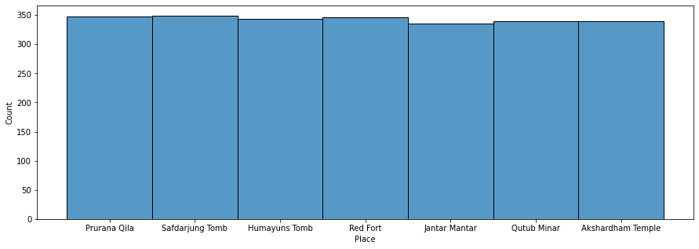
    


Selecting a location for further analysis and prediction.


```python
location_of_analysis = 'Qutub Minar'
capacity_of_location = 0
```

Filtering the dataset for the location of our interest.


```python
df = df[df['Place'].str.contains(location_of_analysis)]
```


```python
df.head(5)
```


  <div id="df-64417f10-9e4d-458e-bddb-c8ee50f531d8">
    <div class="colab-df-container">
      <div>
<style scoped>
    .dataframe tbody tr th:only-of-type {
        vertical-align: middle;
    }

    .dataframe tbody tr th {
        vertical-align: top;
    }

    .dataframe thead th {
        text-align: right;
    }
</style>
<table border="1" class="dataframe">
  <thead>
    <tr style="text-align: right;">
      <th></th>
      <th>id</th>
      <th>Name</th>
      <th>Date</th>
      <th>Timestamp</th>
      <th>Place</th>
      <th>In Time</th>
      <th>Total</th>
    </tr>
  </thead>
  <tbody>
    <tr>
      <th>9</th>
      <td>10</td>
      <td>Hamel Mathieu</td>
      <td>09-03-22</td>
      <td>Wed</td>
      <td>Qutub Minar</td>
      <td>12:50</td>
      <td>9</td>
    </tr>
    <tr>
      <th>11</th>
      <td>12</td>
      <td>Jeremie Hartless</td>
      <td>20-03-22</td>
      <td>Sun</td>
      <td>Qutub Minar</td>
      <td>15:07</td>
      <td>6</td>
    </tr>
    <tr>
      <th>13</th>
      <td>14</td>
      <td>Katheryn Sitford</td>
      <td>05-03-22</td>
      <td>Sat</td>
      <td>Qutub Minar</td>
      <td>12:57</td>
      <td>7</td>
    </tr>
    <tr>
      <th>24</th>
      <td>25</td>
      <td>Avrom Phalip</td>
      <td>13-03-22</td>
      <td>Sun</td>
      <td>Qutub Minar</td>
      <td>13:19</td>
      <td>14</td>
    </tr>
    <tr>
      <th>31</th>
      <td>32</td>
      <td>Astrid Bristowe</td>
      <td>05-03-22</td>
      <td>Sat</td>
      <td>Qutub Minar</td>
      <td>11:00</td>
      <td>12</td>
    </tr>
  </tbody>
</table>
</div>
      <button class="colab-df-convert" onclick="convertToInteractive('df-64417f10-9e4d-458e-bddb-c8ee50f531d8')"
              title="Convert this dataframe to an interactive table."
              style="display:none;">

  <svg xmlns="http://www.w3.org/2000/svg" height="24px"viewBox="0 0 24 24"
       width="24px">
    <path d="M0 0h24v24H0V0z" fill="none"/>
    <path d="M18.56 5.44l.94 2.06.94-2.06 2.06-.94-2.06-.94-.94-2.06-.94 2.06-2.06.94zm-11 1L8.5 8.5l.94-2.06 2.06-.94-2.06-.94L8.5 2.5l-.94 2.06-2.06.94zm10 10l.94 2.06.94-2.06 2.06-.94-2.06-.94-.94-2.06-.94 2.06-2.06.94z"/><path d="M17.41 7.96l-1.37-1.37c-.4-.4-.92-.59-1.43-.59-.52 0-1.04.2-1.43.59L10.3 9.45l-7.72 7.72c-.78.78-.78 2.05 0 2.83L4 21.41c.39.39.9.59 1.41.59.51 0 1.02-.2 1.41-.59l7.78-7.78 2.81-2.81c.8-.78.8-2.07 0-2.86zM5.41 20L4 18.59l7.72-7.72 1.47 1.35L5.41 20z"/>
  </svg>
      </button>

  <style>
    .colab-df-container {
      display:flex;
      flex-wrap:wrap;
      gap: 12px;
    }

    .colab-df-convert {
      background-color: #E8F0FE;
      border: none;
      border-radius: 50%;
      cursor: pointer;
      display: none;
      fill: #1967D2;
      height: 32px;
      padding: 0 0 0 0;
      width: 32px;
    }

    .colab-df-convert:hover {
      background-color: #E2EBFA;
      box-shadow: 0px 1px 2px rgba(60, 64, 67, 0.3), 0px 1px 3px 1px rgba(60, 64, 67, 0.15);
      fill: #174EA6;
    }

    [theme=dark] .colab-df-convert {
      background-color: #3B4455;
      fill: #D2E3FC;
    }

    [theme=dark] .colab-df-convert:hover {
      background-color: #434B5C;
      box-shadow: 0px 1px 3px 1px rgba(0, 0, 0, 0.15);
      filter: drop-shadow(0px 1px 2px rgba(0, 0, 0, 0.3));
      fill: #FFFFFF;
    }
  </style>

      <script>
        const buttonEl =
          document.querySelector('#df-64417f10-9e4d-458e-bddb-c8ee50f531d8 button.colab-df-convert');
        buttonEl.style.display =
          google.colab.kernel.accessAllowed ? 'block' : 'none';

        async function convertToInteractive(key) {
          const element = document.querySelector('#df-64417f10-9e4d-458e-bddb-c8ee50f531d8');
          const dataTable =
            await google.colab.kernel.invokeFunction('convertToInteractive',
                                                     [key], {});
          if (!dataTable) return;

          const docLinkHtml = 'Like what you see? Visit the ' +
            '<a target="_blank" href=https://colab.research.google.com/notebooks/data_table.ipynb>data table notebook</a>'
            + ' to learn more about interactive tables.';
          element.innerHTML = '';
          dataTable['output_type'] = 'display_data';
          await google.colab.output.renderOutput(dataTable, element);
          const docLink = document.createElement('div');
          docLink.innerHTML = docLinkHtml;
          element.appendChild(docLink);
        }
      </script>
    </div>
  </div>


Make dataframe of exit data collected from camera.


```python
df_exits = pd.read_csv('travio_exits.csv')
```


```python
df_exits.head(5)
```


  <div id="df-05e0730a-f4b4-4434-9d04-0c5f34ad3fd9">
    <div class="colab-df-container">
      <div>
<style scoped>
    .dataframe tbody tr th:only-of-type {
        vertical-align: middle;
    }

    .dataframe tbody tr th {
        vertical-align: top;
    }

    .dataframe thead th {
        text-align: right;
    }
</style>
<table border="1" class="dataframe">
  <thead>
    <tr style="text-align: right;">
      <th></th>
      <th>date</th>
      <th>time</th>
      <th>exits</th>
    </tr>
  </thead>
  <tbody>
    <tr>
      <th>0</th>
      <td>15-03-2022</td>
      <td>15:03</td>
      <td>3</td>
    </tr>
    <tr>
      <th>1</th>
      <td>08-02-2022</td>
      <td>10:00</td>
      <td>5</td>
    </tr>
    <tr>
      <th>2</th>
      <td>13-02-2022</td>
      <td>9:43</td>
      <td>4</td>
    </tr>
    <tr>
      <th>3</th>
      <td>22-02-2022</td>
      <td>9:26</td>
      <td>1</td>
    </tr>
    <tr>
      <th>4</th>
      <td>09-03-2022</td>
      <td>16:07</td>
      <td>1</td>
    </tr>
  </tbody>
</table>
</div>
      <button class="colab-df-convert" onclick="convertToInteractive('df-05e0730a-f4b4-4434-9d04-0c5f34ad3fd9')"
              title="Convert this dataframe to an interactive table."
              style="display:none;">

  <svg xmlns="http://www.w3.org/2000/svg" height="24px"viewBox="0 0 24 24"
       width="24px">
    <path d="M0 0h24v24H0V0z" fill="none"/>
    <path d="M18.56 5.44l.94 2.06.94-2.06 2.06-.94-2.06-.94-.94-2.06-.94 2.06-2.06.94zm-11 1L8.5 8.5l.94-2.06 2.06-.94-2.06-.94L8.5 2.5l-.94 2.06-2.06.94zm10 10l.94 2.06.94-2.06 2.06-.94-2.06-.94-.94-2.06-.94 2.06-2.06.94z"/><path d="M17.41 7.96l-1.37-1.37c-.4-.4-.92-.59-1.43-.59-.52 0-1.04.2-1.43.59L10.3 9.45l-7.72 7.72c-.78.78-.78 2.05 0 2.83L4 21.41c.39.39.9.59 1.41.59.51 0 1.02-.2 1.41-.59l7.78-7.78 2.81-2.81c.8-.78.8-2.07 0-2.86zM5.41 20L4 18.59l7.72-7.72 1.47 1.35L5.41 20z"/>
  </svg>
      </button>

  <style>
    .colab-df-container {
      display:flex;
      flex-wrap:wrap;
      gap: 12px;
    }

    .colab-df-convert {
      background-color: #E8F0FE;
      border: none;
      border-radius: 50%;
      cursor: pointer;
      display: none;
      fill: #1967D2;
      height: 32px;
      padding: 0 0 0 0;
      width: 32px;
    }

    .colab-df-convert:hover {
      background-color: #E2EBFA;
      box-shadow: 0px 1px 2px rgba(60, 64, 67, 0.3), 0px 1px 3px 1px rgba(60, 64, 67, 0.15);
      fill: #174EA6;
    }

    [theme=dark] .colab-df-convert {
      background-color: #3B4455;
      fill: #D2E3FC;
    }

    [theme=dark] .colab-df-convert:hover {
      background-color: #434B5C;
      box-shadow: 0px 1px 3px 1px rgba(0, 0, 0, 0.15);
      filter: drop-shadow(0px 1px 2px rgba(0, 0, 0, 0.3));
      fill: #FFFFFF;
    }
  </style>

      <script>
        const buttonEl =
          document.querySelector('#df-05e0730a-f4b4-4434-9d04-0c5f34ad3fd9 button.colab-df-convert');
        buttonEl.style.display =
          google.colab.kernel.accessAllowed ? 'block' : 'none';

        async function convertToInteractive(key) {
          const element = document.querySelector('#df-05e0730a-f4b4-4434-9d04-0c5f34ad3fd9');
          const dataTable =
            await google.colab.kernel.invokeFunction('convertToInteractive',
                                                     [key], {});
          if (!dataTable) return;

          const docLinkHtml = 'Like what you see? Visit the ' +
            '<a target="_blank" href=https://colab.research.google.com/notebooks/data_table.ipynb>data table notebook</a>'
            + ' to learn more about interactive tables.';
          element.innerHTML = '';
          dataTable['output_type'] = 'display_data';
          await google.colab.output.renderOutput(dataTable, element);
          const docLink = document.createElement('div');
          docLink.innerHTML = docLinkHtml;
          element.appendChild(docLink);
        }
      </script>
    </div>
  </div>


To suppress some unnecessary warings.


```python
pd.options.mode.chained_assignment = None
```

Creating a datetime column from In Time and Date


```python
df['datetime'] = pd.to_datetime(df['In Time']+' '+df['Date'], format='%H:%M %d-%m-%y')
```

Converting the various columns from string to datetime type


```python
df['Hour'] = df['datetime'].dt.hour
df['Date'] = df['datetime'].dt.date
df['In Time'] = df['datetime'].dt.time
```

Extracting the week numbers from dates


```python
df['week_number'] = df['datetime'].dt.isocalendar().week
```

Making Timestamp column categorical.


```python
cats = ['Mon', 'Tue', 'Wed', 'Thu', 'Fri', 'Sat', 'Sun']
df['Timestamp'] = pd.Categorical(df['Timestamp'], categories=cats, ordered=True)
```

The total number of weeks represented in the data.


```python
no_of_weeks = len(df['week_number'].unique())
```

Make a date time column from time and date for exits data.


```python
df_exits['datetime'] = pd.to_datetime(df_exits['time']+' '+df_exits['date'], format='%H:%M %d-%m-%Y')
```

# Analysis of the data.

**Predictive Analysis**

Goal — Using historical or current data to find patterns to make predictions about the future

Description:

Accuracy of the predictions depends on the input variables
Accuracy also depends on the types of models, a linear model might work well in some cases, and vice-versa
Using a variable to predict another doesn’t denote a causal relationships

In short it takes data from the past and present to make predictions about the future.

## Columns and their description.


```python
df.columns
```


    Index(['id', 'Name', 'Date', 'Timestamp', 'Place', 'In Time', 'Total',
           'datetime', 'Hour', 'week_number'],
          dtype='object')


- id : A numeric identifier for each visitor.
- Name: Name of visitor.
- Date: The date of visit of the visitor.
- Timestamp (basically 'Day' a mistake during generation of data): Day of the week.
- Place: The location of visit.
- In Time: The time of scan of the QR Code at entry.
- Total: The totalnumber of entries at that point of time.
- datetime: The combined Date+Time data.
- Hour: The hour slot of entry.
- week_number: The number of week of that year.


```python
fig = plt.figure(figsize=(20,7))
sns.boxplot(x="Timestamp", y="Total", hue="Hour", data=df)
plt.legend(title='Hours:',bbox_to_anchor=(1.05, 1), loc=1)
```


    <matplotlib.legend.Legend at 0x7f54e682e550>


    
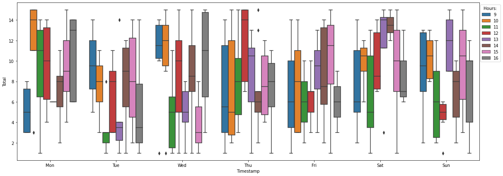
    


## Visits grouped into weekdays


```python
df.groupby('Timestamp')['Total'].sum().divide(other=no_of_weeks).plot(kind='bar',colormap = 'Set1')
plt.ylabel('Visits')
capacity_of_location = df.groupby('Timestamp')['Total'].sum().divide(other=no_of_weeks).values.mean()
plt.hlines(capacity_of_location, xmin = -1, xmax=7, linestyles='dashed', label='mean visits', colors='b')
```


    <matplotlib.collections.LineCollection at 0x7f54e603da10>


    
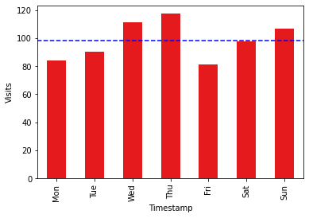
    


## Visits grouped into time slots


```python
df.groupby('Hour')['Total'].sum().divide(other=no_of_weeks).plot(kind='bar',colormap = 'Set1')
plt.ylabel('Visits')
capacity_of_location = df.groupby('Hour')['Total'].sum().divide(other=no_of_weeks).values.mean()
plt.hlines(capacity_of_location,xmin = -1, xmax=8,linestyles='dashed', label='mean visits',colors='b')
```


    <matplotlib.collections.LineCollection at 0x7f54e5ffa110>


    
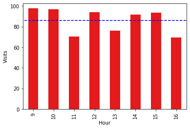
    


## Visits for time slots for each weekday


```python
fig, ax = plt.subplots(ncols=4,nrows=2, figsize = (20,10))
index = 0
ax = ax.flatten()
for weekday in cats:
    ax[index].bar(df.groupby(['Timestamp','Hour'])['Total'].sum()[(weekday)].index, df.groupby(['Timestamp','Hour'])['Total'].sum().divide(other=no_of_weeks)[(weekday)].values)
    ax[index].set_ylabel('Visits')
    ax[index].set_xlabel('Hour of day')
    ax[index].set_title(weekday+' Time vs Visits')
    capacity_of_location = df.groupby(['Timestamp','Hour'])['Total'].sum().divide(other=no_of_weeks)[(weekday)].values.mean()
    ax[index].hlines(capacity_of_location, xmin = 8, xmax=17,linestyles='dashed', label='mean visits',colors='r')
    index+=1
```


    
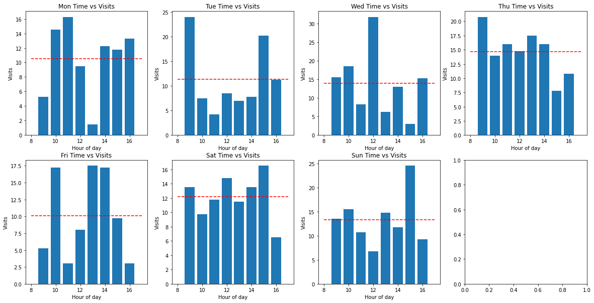
    


## Prepare dataframe for time series analysis and modeling


```python
df.info()
```

    <class 'pandas.core.frame.DataFrame'>
    Int64Index: 340 entries, 9 to 2397
    Data columns (total 10 columns):
     #   Column       Non-Null Count  Dtype         
    ---  ------       --------------  -----         
     0   id           340 non-null    int64         
     1   Name         340 non-null    object        
     2   Date         340 non-null    object        
     3   Timestamp    340 non-null    category      
     4   Place        340 non-null    object        
     5   In Time      340 non-null    object        
     6   Total        340 non-null    int64         
     7   datetime     340 non-null    datetime64[ns]
     8   Hour         340 non-null    int64         
     9   week_number  340 non-null    UInt32        
    dtypes: UInt32(1), category(1), datetime64[ns](1), int64(3), object(4)
    memory usage: 34.3+ KB
    


```python
df_exits.info()
```

    <class 'pandas.core.frame.DataFrame'>
    RangeIndex: 400 entries, 0 to 399
    Data columns (total 4 columns):
     #   Column    Non-Null Count  Dtype         
    ---  ------    --------------  -----         
     0   date      400 non-null    object        
     1   time      400 non-null    object        
     2   exits     400 non-null    int64         
     3   datetime  400 non-null    datetime64[ns]
    dtypes: datetime64[ns](1), int64(1), object(2)
    memory usage: 12.6+ KB
    


```python
#df = df[df['week_number']>(max(df['week_number'].unique())-3)]
```

### Sorting the data by date time to make time series


```python
df_sorted = df.sort_values('datetime')
df_exits = df_exits.sort_values('datetime')
```


```python
df_sorted.head(5)
```


  <div id="df-a108baec-904f-4126-87fb-700aef192e02">
    <div class="colab-df-container">
      <div>
<style scoped>
    .dataframe tbody tr th:only-of-type {
        vertical-align: middle;
    }

    .dataframe tbody tr th {
        vertical-align: top;
    }

    .dataframe thead th {
        text-align: right;
    }
</style>
<table border="1" class="dataframe">
  <thead>
    <tr style="text-align: right;">
      <th></th>
      <th>id</th>
      <th>Name</th>
      <th>Date</th>
      <th>Timestamp</th>
      <th>Place</th>
      <th>In Time</th>
      <th>Total</th>
      <th>datetime</th>
      <th>Hour</th>
      <th>week_number</th>
    </tr>
  </thead>
  <tbody>
    <tr>
      <th>1151</th>
      <td>452</td>
      <td>Robbi Varren</td>
      <td>2022-03-01</td>
      <td>Tue</td>
      <td>Qutub Minar</td>
      <td>09:06:00</td>
      <td>8</td>
      <td>2022-03-01 09:06:00</td>
      <td>9</td>
      <td>9</td>
    </tr>
    <tr>
      <th>1849</th>
      <td>450</td>
      <td>Richard Hulke</td>
      <td>2022-03-01</td>
      <td>Tue</td>
      <td>Qutub Minar</td>
      <td>09:39:00</td>
      <td>5</td>
      <td>2022-03-01 09:39:00</td>
      <td>9</td>
      <td>9</td>
    </tr>
    <tr>
      <th>617</th>
      <td>618</td>
      <td>Grange MacCallester</td>
      <td>2022-03-01</td>
      <td>Tue</td>
      <td>Qutub Minar</td>
      <td>09:53:00</td>
      <td>8</td>
      <td>2022-03-01 09:53:00</td>
      <td>9</td>
      <td>9</td>
    </tr>
    <tr>
      <th>307</th>
      <td>308</td>
      <td>Lannie Brisland</td>
      <td>2022-03-01</td>
      <td>Tue</td>
      <td>Qutub Minar</td>
      <td>11:31:00</td>
      <td>3</td>
      <td>2022-03-01 11:31:00</td>
      <td>11</td>
      <td>9</td>
    </tr>
    <tr>
      <th>220</th>
      <td>221</td>
      <td>Isadore Gritland</td>
      <td>2022-03-01</td>
      <td>Tue</td>
      <td>Qutub Minar</td>
      <td>11:54:00</td>
      <td>3</td>
      <td>2022-03-01 11:54:00</td>
      <td>11</td>
      <td>9</td>
    </tr>
  </tbody>
</table>
</div>
      <button class="colab-df-convert" onclick="convertToInteractive('df-a108baec-904f-4126-87fb-700aef192e02')"
              title="Convert this dataframe to an interactive table."
              style="display:none;">

  <svg xmlns="http://www.w3.org/2000/svg" height="24px"viewBox="0 0 24 24"
       width="24px">
    <path d="M0 0h24v24H0V0z" fill="none"/>
    <path d="M18.56 5.44l.94 2.06.94-2.06 2.06-.94-2.06-.94-.94-2.06-.94 2.06-2.06.94zm-11 1L8.5 8.5l.94-2.06 2.06-.94-2.06-.94L8.5 2.5l-.94 2.06-2.06.94zm10 10l.94 2.06.94-2.06 2.06-.94-2.06-.94-.94-2.06-.94 2.06-2.06.94z"/><path d="M17.41 7.96l-1.37-1.37c-.4-.4-.92-.59-1.43-.59-.52 0-1.04.2-1.43.59L10.3 9.45l-7.72 7.72c-.78.78-.78 2.05 0 2.83L4 21.41c.39.39.9.59 1.41.59.51 0 1.02-.2 1.41-.59l7.78-7.78 2.81-2.81c.8-.78.8-2.07 0-2.86zM5.41 20L4 18.59l7.72-7.72 1.47 1.35L5.41 20z"/>
  </svg>
      </button>

  <style>
    .colab-df-container {
      display:flex;
      flex-wrap:wrap;
      gap: 12px;
    }

    .colab-df-convert {
      background-color: #E8F0FE;
      border: none;
      border-radius: 50%;
      cursor: pointer;
      display: none;
      fill: #1967D2;
      height: 32px;
      padding: 0 0 0 0;
      width: 32px;
    }

    .colab-df-convert:hover {
      background-color: #E2EBFA;
      box-shadow: 0px 1px 2px rgba(60, 64, 67, 0.3), 0px 1px 3px 1px rgba(60, 64, 67, 0.15);
      fill: #174EA6;
    }

    [theme=dark] .colab-df-convert {
      background-color: #3B4455;
      fill: #D2E3FC;
    }

    [theme=dark] .colab-df-convert:hover {
      background-color: #434B5C;
      box-shadow: 0px 1px 3px 1px rgba(0, 0, 0, 0.15);
      filter: drop-shadow(0px 1px 2px rgba(0, 0, 0, 0.3));
      fill: #FFFFFF;
    }
  </style>

      <script>
        const buttonEl =
          document.querySelector('#df-a108baec-904f-4126-87fb-700aef192e02 button.colab-df-convert');
        buttonEl.style.display =
          google.colab.kernel.accessAllowed ? 'block' : 'none';

        async function convertToInteractive(key) {
          const element = document.querySelector('#df-a108baec-904f-4126-87fb-700aef192e02');
          const dataTable =
            await google.colab.kernel.invokeFunction('convertToInteractive',
                                                     [key], {});
          if (!dataTable) return;

          const docLinkHtml = 'Like what you see? Visit the ' +
            '<a target="_blank" href=https://colab.research.google.com/notebooks/data_table.ipynb>data table notebook</a>'
            + ' to learn more about interactive tables.';
          element.innerHTML = '';
          dataTable['output_type'] = 'display_data';
          await google.colab.output.renderOutput(dataTable, element);
          const docLink = document.createElement('div');
          docLink.innerHTML = docLinkHtml;
          element.appendChild(docLink);
        }
      </script>
    </div>
  </div>


```python
df_exits.head(5)
```


  <div id="df-d97be8a3-78de-44d0-85d6-f0989e0b54f8">
    <div class="colab-df-container">
      <div>
<style scoped>
    .dataframe tbody tr th:only-of-type {
        vertical-align: middle;
    }

    .dataframe tbody tr th {
        vertical-align: top;
    }

    .dataframe thead th {
        text-align: right;
    }
</style>
<table border="1" class="dataframe">
  <thead>
    <tr style="text-align: right;">
      <th></th>
      <th>date</th>
      <th>time</th>
      <th>exits</th>
      <th>datetime</th>
    </tr>
  </thead>
  <tbody>
    <tr>
      <th>225</th>
      <td>01-02-2022</td>
      <td>9:06</td>
      <td>7</td>
      <td>2022-02-01 09:06:00</td>
    </tr>
    <tr>
      <th>73</th>
      <td>01-02-2022</td>
      <td>9:23</td>
      <td>1</td>
      <td>2022-02-01 09:23:00</td>
    </tr>
    <tr>
      <th>149</th>
      <td>01-02-2022</td>
      <td>10:13</td>
      <td>6</td>
      <td>2022-02-01 10:13:00</td>
    </tr>
    <tr>
      <th>171</th>
      <td>01-02-2022</td>
      <td>10:21</td>
      <td>1</td>
      <td>2022-02-01 10:21:00</td>
    </tr>
    <tr>
      <th>378</th>
      <td>01-02-2022</td>
      <td>10:50</td>
      <td>5</td>
      <td>2022-02-01 10:50:00</td>
    </tr>
  </tbody>
</table>
</div>
      <button class="colab-df-convert" onclick="convertToInteractive('df-d97be8a3-78de-44d0-85d6-f0989e0b54f8')"
              title="Convert this dataframe to an interactive table."
              style="display:none;">

  <svg xmlns="http://www.w3.org/2000/svg" height="24px"viewBox="0 0 24 24"
       width="24px">
    <path d="M0 0h24v24H0V0z" fill="none"/>
    <path d="M18.56 5.44l.94 2.06.94-2.06 2.06-.94-2.06-.94-.94-2.06-.94 2.06-2.06.94zm-11 1L8.5 8.5l.94-2.06 2.06-.94-2.06-.94L8.5 2.5l-.94 2.06-2.06.94zm10 10l.94 2.06.94-2.06 2.06-.94-2.06-.94-.94-2.06-.94 2.06-2.06.94z"/><path d="M17.41 7.96l-1.37-1.37c-.4-.4-.92-.59-1.43-.59-.52 0-1.04.2-1.43.59L10.3 9.45l-7.72 7.72c-.78.78-.78 2.05 0 2.83L4 21.41c.39.39.9.59 1.41.59.51 0 1.02-.2 1.41-.59l7.78-7.78 2.81-2.81c.8-.78.8-2.07 0-2.86zM5.41 20L4 18.59l7.72-7.72 1.47 1.35L5.41 20z"/>
  </svg>
      </button>

  <style>
    .colab-df-container {
      display:flex;
      flex-wrap:wrap;
      gap: 12px;
    }

    .colab-df-convert {
      background-color: #E8F0FE;
      border: none;
      border-radius: 50%;
      cursor: pointer;
      display: none;
      fill: #1967D2;
      height: 32px;
      padding: 0 0 0 0;
      width: 32px;
    }

    .colab-df-convert:hover {
      background-color: #E2EBFA;
      box-shadow: 0px 1px 2px rgba(60, 64, 67, 0.3), 0px 1px 3px 1px rgba(60, 64, 67, 0.15);
      fill: #174EA6;
    }

    [theme=dark] .colab-df-convert {
      background-color: #3B4455;
      fill: #D2E3FC;
    }

    [theme=dark] .colab-df-convert:hover {
      background-color: #434B5C;
      box-shadow: 0px 1px 3px 1px rgba(0, 0, 0, 0.15);
      filter: drop-shadow(0px 1px 2px rgba(0, 0, 0, 0.3));
      fill: #FFFFFF;
    }
  </style>

      <script>
        const buttonEl =
          document.querySelector('#df-d97be8a3-78de-44d0-85d6-f0989e0b54f8 button.colab-df-convert');
        buttonEl.style.display =
          google.colab.kernel.accessAllowed ? 'block' : 'none';

        async function convertToInteractive(key) {
          const element = document.querySelector('#df-d97be8a3-78de-44d0-85d6-f0989e0b54f8');
          const dataTable =
            await google.colab.kernel.invokeFunction('convertToInteractive',
                                                     [key], {});
          if (!dataTable) return;

          const docLinkHtml = 'Like what you see? Visit the ' +
            '<a target="_blank" href=https://colab.research.google.com/notebooks/data_table.ipynb>data table notebook</a>'
            + ' to learn more about interactive tables.';
          element.innerHTML = '';
          dataTable['output_type'] = 'display_data';
          await google.colab.output.renderOutput(dataTable, element);
          const docLink = document.createElement('div');
          docLink.innerHTML = docLinkHtml;
          element.appendChild(docLink);
        }
      </script>
    </div>
  </div>


### Detour: Rough estimation of time taken to visit this place from entry to exit.


```python
import datetime
diff = []
for (i, row1), (j, row2) in zip(df_sorted.head(10).iterrows(), df_exits.head(10).iterrows()):
  diff.append(row2['datetime'] - row1['datetime'])
print(diff)
average = sum(diff, datetime.timedelta(0)) / len(diff)
print('Rough estimation of time taken is ', average)
```

    [Timedelta('-28 days +00:00:00'), Timedelta('-29 days +23:44:00'), Timedelta('-28 days +00:20:00'), Timedelta('-29 days +22:50:00'), Timedelta('-29 days +22:56:00'), Timedelta('-29 days +21:18:00'), Timedelta('-29 days +21:28:00'), Timedelta('-29 days +21:47:00'), Timedelta('-29 days +22:58:00'), Timedelta('-28 days +00:10:00')]
    Rough estimation of time taken is  -29 days +22:57:06
    

Making seconds and minutes as zero to make hourly slots of the data and to predict crowd for each slot.


```python
df_sorted['datetime'] = pd.to_datetime(df_sorted['datetime']).dt.floor('H')
df_exits['datetime'] = pd.to_datetime(df_exits['datetime']).dt.floor('H')
```


```python
# df_sorted.drop_duplicates(inplace=True)
# df_exits.drop_duplicates(inplace=True)
```

Setting date time column as index of dataframe for time series analyis.


```python
df_ts = df_sorted[['datetime', 'Total']].set_index('datetime')
df_ts_exits = df_exits[['datetime', 'exits']].set_index('datetime')
```

Resampling the series to hourly frequency to make continuous data without any gaps.


```python
df_ts = df_ts.resample('H').sum().ffill().reset_index()
df_ts_exits = df_ts_exits.resample('H').sum().ffill().reset_index()
```


```python
df_ts.set_index('datetime',inplace=True)
df_ts_exits.set_index('datetime',inplace=True)
```


```python
df_ts.head(5)
```


  <div id="df-432667ff-6b3f-479b-afdb-affe54c75801">
    <div class="colab-df-container">
      <div>
<style scoped>
    .dataframe tbody tr th:only-of-type {
        vertical-align: middle;
    }

    .dataframe tbody tr th {
        vertical-align: top;
    }

    .dataframe thead th {
        text-align: right;
    }
</style>
<table border="1" class="dataframe">
  <thead>
    <tr style="text-align: right;">
      <th></th>
      <th>Total</th>
    </tr>
    <tr>
      <th>datetime</th>
      <th></th>
    </tr>
  </thead>
  <tbody>
    <tr>
      <th>2022-03-01 09:00:00</th>
      <td>21</td>
    </tr>
    <tr>
      <th>2022-03-01 10:00:00</th>
      <td>0</td>
    </tr>
    <tr>
      <th>2022-03-01 11:00:00</th>
      <td>6</td>
    </tr>
    <tr>
      <th>2022-03-01 12:00:00</th>
      <td>0</td>
    </tr>
    <tr>
      <th>2022-03-01 13:00:00</th>
      <td>1</td>
    </tr>
  </tbody>
</table>
</div>
      <button class="colab-df-convert" onclick="convertToInteractive('df-432667ff-6b3f-479b-afdb-affe54c75801')"
              title="Convert this dataframe to an interactive table."
              style="display:none;">

  <svg xmlns="http://www.w3.org/2000/svg" height="24px"viewBox="0 0 24 24"
       width="24px">
    <path d="M0 0h24v24H0V0z" fill="none"/>
    <path d="M18.56 5.44l.94 2.06.94-2.06 2.06-.94-2.06-.94-.94-2.06-.94 2.06-2.06.94zm-11 1L8.5 8.5l.94-2.06 2.06-.94-2.06-.94L8.5 2.5l-.94 2.06-2.06.94zm10 10l.94 2.06.94-2.06 2.06-.94-2.06-.94-.94-2.06-.94 2.06-2.06.94z"/><path d="M17.41 7.96l-1.37-1.37c-.4-.4-.92-.59-1.43-.59-.52 0-1.04.2-1.43.59L10.3 9.45l-7.72 7.72c-.78.78-.78 2.05 0 2.83L4 21.41c.39.39.9.59 1.41.59.51 0 1.02-.2 1.41-.59l7.78-7.78 2.81-2.81c.8-.78.8-2.07 0-2.86zM5.41 20L4 18.59l7.72-7.72 1.47 1.35L5.41 20z"/>
  </svg>
      </button>

  <style>
    .colab-df-container {
      display:flex;
      flex-wrap:wrap;
      gap: 12px;
    }

    .colab-df-convert {
      background-color: #E8F0FE;
      border: none;
      border-radius: 50%;
      cursor: pointer;
      display: none;
      fill: #1967D2;
      height: 32px;
      padding: 0 0 0 0;
      width: 32px;
    }

    .colab-df-convert:hover {
      background-color: #E2EBFA;
      box-shadow: 0px 1px 2px rgba(60, 64, 67, 0.3), 0px 1px 3px 1px rgba(60, 64, 67, 0.15);
      fill: #174EA6;
    }

    [theme=dark] .colab-df-convert {
      background-color: #3B4455;
      fill: #D2E3FC;
    }

    [theme=dark] .colab-df-convert:hover {
      background-color: #434B5C;
      box-shadow: 0px 1px 3px 1px rgba(0, 0, 0, 0.15);
      filter: drop-shadow(0px 1px 2px rgba(0, 0, 0, 0.3));
      fill: #FFFFFF;
    }
  </style>

      <script>
        const buttonEl =
          document.querySelector('#df-432667ff-6b3f-479b-afdb-affe54c75801 button.colab-df-convert');
        buttonEl.style.display =
          google.colab.kernel.accessAllowed ? 'block' : 'none';

        async function convertToInteractive(key) {
          const element = document.querySelector('#df-432667ff-6b3f-479b-afdb-affe54c75801');
          const dataTable =
            await google.colab.kernel.invokeFunction('convertToInteractive',
                                                     [key], {});
          if (!dataTable) return;

          const docLinkHtml = 'Like what you see? Visit the ' +
            '<a target="_blank" href=https://colab.research.google.com/notebooks/data_table.ipynb>data table notebook</a>'
            + ' to learn more about interactive tables.';
          element.innerHTML = '';
          dataTable['output_type'] = 'display_data';
          await google.colab.output.renderOutput(dataTable, element);
          const docLink = document.createElement('div');
          docLink.innerHTML = docLinkHtml;
          element.appendChild(docLink);
        }
      </script>
    </div>
  </div>


```python
df_ts_exits.head(5)
```


  <div id="df-d4e3e700-1dd7-4401-adde-2c24f9001f33">
    <div class="colab-df-container">
      <div>
<style scoped>
    .dataframe tbody tr th:only-of-type {
        vertical-align: middle;
    }

    .dataframe tbody tr th {
        vertical-align: top;
    }

    .dataframe thead th {
        text-align: right;
    }
</style>
<table border="1" class="dataframe">
  <thead>
    <tr style="text-align: right;">
      <th></th>
      <th>exits</th>
    </tr>
    <tr>
      <th>datetime</th>
      <th></th>
    </tr>
  </thead>
  <tbody>
    <tr>
      <th>2022-02-01 09:00:00</th>
      <td>8</td>
    </tr>
    <tr>
      <th>2022-02-01 10:00:00</th>
      <td>12</td>
    </tr>
    <tr>
      <th>2022-02-01 11:00:00</th>
      <td>4</td>
    </tr>
    <tr>
      <th>2022-02-01 12:00:00</th>
      <td>3</td>
    </tr>
    <tr>
      <th>2022-02-01 13:00:00</th>
      <td>2</td>
    </tr>
  </tbody>
</table>
</div>
      <button class="colab-df-convert" onclick="convertToInteractive('df-d4e3e700-1dd7-4401-adde-2c24f9001f33')"
              title="Convert this dataframe to an interactive table."
              style="display:none;">

  <svg xmlns="http://www.w3.org/2000/svg" height="24px"viewBox="0 0 24 24"
       width="24px">
    <path d="M0 0h24v24H0V0z" fill="none"/>
    <path d="M18.56 5.44l.94 2.06.94-2.06 2.06-.94-2.06-.94-.94-2.06-.94 2.06-2.06.94zm-11 1L8.5 8.5l.94-2.06 2.06-.94-2.06-.94L8.5 2.5l-.94 2.06-2.06.94zm10 10l.94 2.06.94-2.06 2.06-.94-2.06-.94-.94-2.06-.94 2.06-2.06.94z"/><path d="M17.41 7.96l-1.37-1.37c-.4-.4-.92-.59-1.43-.59-.52 0-1.04.2-1.43.59L10.3 9.45l-7.72 7.72c-.78.78-.78 2.05 0 2.83L4 21.41c.39.39.9.59 1.41.59.51 0 1.02-.2 1.41-.59l7.78-7.78 2.81-2.81c.8-.78.8-2.07 0-2.86zM5.41 20L4 18.59l7.72-7.72 1.47 1.35L5.41 20z"/>
  </svg>
      </button>

  <style>
    .colab-df-container {
      display:flex;
      flex-wrap:wrap;
      gap: 12px;
    }

    .colab-df-convert {
      background-color: #E8F0FE;
      border: none;
      border-radius: 50%;
      cursor: pointer;
      display: none;
      fill: #1967D2;
      height: 32px;
      padding: 0 0 0 0;
      width: 32px;
    }

    .colab-df-convert:hover {
      background-color: #E2EBFA;
      box-shadow: 0px 1px 2px rgba(60, 64, 67, 0.3), 0px 1px 3px 1px rgba(60, 64, 67, 0.15);
      fill: #174EA6;
    }

    [theme=dark] .colab-df-convert {
      background-color: #3B4455;
      fill: #D2E3FC;
    }

    [theme=dark] .colab-df-convert:hover {
      background-color: #434B5C;
      box-shadow: 0px 1px 3px 1px rgba(0, 0, 0, 0.15);
      filter: drop-shadow(0px 1px 2px rgba(0, 0, 0, 0.3));
      fill: #FFFFFF;
    }
  </style>

      <script>
        const buttonEl =
          document.querySelector('#df-d4e3e700-1dd7-4401-adde-2c24f9001f33 button.colab-df-convert');
        buttonEl.style.display =
          google.colab.kernel.accessAllowed ? 'block' : 'none';

        async function convertToInteractive(key) {
          const element = document.querySelector('#df-d4e3e700-1dd7-4401-adde-2c24f9001f33');
          const dataTable =
            await google.colab.kernel.invokeFunction('convertToInteractive',
                                                     [key], {});
          if (!dataTable) return;

          const docLinkHtml = 'Like what you see? Visit the ' +
            '<a target="_blank" href=https://colab.research.google.com/notebooks/data_table.ipynb>data table notebook</a>'
            + ' to learn more about interactive tables.';
          element.innerHTML = '';
          dataTable['output_type'] = 'display_data';
          await google.colab.output.renderOutput(dataTable, element);
          const docLink = document.createElement('div');
          docLink.innerHTML = docLinkHtml;
          element.appendChild(docLink);
        }
      </script>
    </div>
  </div>


#### Intersecting the Entry dataframe and the exits dataframe to have common time period. Having common time period means we can subtract the entry and exit to get approximate estimation of the crowd present in that given time slot.


```python
intersecting_idx = df_ts_exits.index.intersection(df_ts.index)
```


```python
df_ts = df_ts.loc[intersecting_idx]
```


```python
df_ts.head(5)
```


  <div id="df-7987f7e9-64fb-4bbd-99a6-b8a00c0436f7">
    <div class="colab-df-container">
      <div>
<style scoped>
    .dataframe tbody tr th:only-of-type {
        vertical-align: middle;
    }

    .dataframe tbody tr th {
        vertical-align: top;
    }

    .dataframe thead th {
        text-align: right;
    }
</style>
<table border="1" class="dataframe">
  <thead>
    <tr style="text-align: right;">
      <th></th>
      <th>Total</th>
    </tr>
    <tr>
      <th>datetime</th>
      <th></th>
    </tr>
  </thead>
  <tbody>
    <tr>
      <th>2022-03-01 09:00:00</th>
      <td>21</td>
    </tr>
    <tr>
      <th>2022-03-01 10:00:00</th>
      <td>0</td>
    </tr>
    <tr>
      <th>2022-03-01 11:00:00</th>
      <td>6</td>
    </tr>
    <tr>
      <th>2022-03-01 12:00:00</th>
      <td>0</td>
    </tr>
    <tr>
      <th>2022-03-01 13:00:00</th>
      <td>1</td>
    </tr>
  </tbody>
</table>
</div>
      <button class="colab-df-convert" onclick="convertToInteractive('df-7987f7e9-64fb-4bbd-99a6-b8a00c0436f7')"
              title="Convert this dataframe to an interactive table."
              style="display:none;">

  <svg xmlns="http://www.w3.org/2000/svg" height="24px"viewBox="0 0 24 24"
       width="24px">
    <path d="M0 0h24v24H0V0z" fill="none"/>
    <path d="M18.56 5.44l.94 2.06.94-2.06 2.06-.94-2.06-.94-.94-2.06-.94 2.06-2.06.94zm-11 1L8.5 8.5l.94-2.06 2.06-.94-2.06-.94L8.5 2.5l-.94 2.06-2.06.94zm10 10l.94 2.06.94-2.06 2.06-.94-2.06-.94-.94-2.06-.94 2.06-2.06.94z"/><path d="M17.41 7.96l-1.37-1.37c-.4-.4-.92-.59-1.43-.59-.52 0-1.04.2-1.43.59L10.3 9.45l-7.72 7.72c-.78.78-.78 2.05 0 2.83L4 21.41c.39.39.9.59 1.41.59.51 0 1.02-.2 1.41-.59l7.78-7.78 2.81-2.81c.8-.78.8-2.07 0-2.86zM5.41 20L4 18.59l7.72-7.72 1.47 1.35L5.41 20z"/>
  </svg>
      </button>

  <style>
    .colab-df-container {
      display:flex;
      flex-wrap:wrap;
      gap: 12px;
    }

    .colab-df-convert {
      background-color: #E8F0FE;
      border: none;
      border-radius: 50%;
      cursor: pointer;
      display: none;
      fill: #1967D2;
      height: 32px;
      padding: 0 0 0 0;
      width: 32px;
    }

    .colab-df-convert:hover {
      background-color: #E2EBFA;
      box-shadow: 0px 1px 2px rgba(60, 64, 67, 0.3), 0px 1px 3px 1px rgba(60, 64, 67, 0.15);
      fill: #174EA6;
    }

    [theme=dark] .colab-df-convert {
      background-color: #3B4455;
      fill: #D2E3FC;
    }

    [theme=dark] .colab-df-convert:hover {
      background-color: #434B5C;
      box-shadow: 0px 1px 3px 1px rgba(0, 0, 0, 0.15);
      filter: drop-shadow(0px 1px 2px rgba(0, 0, 0, 0.3));
      fill: #FFFFFF;
    }
  </style>

      <script>
        const buttonEl =
          document.querySelector('#df-7987f7e9-64fb-4bbd-99a6-b8a00c0436f7 button.colab-df-convert');
        buttonEl.style.display =
          google.colab.kernel.accessAllowed ? 'block' : 'none';

        async function convertToInteractive(key) {
          const element = document.querySelector('#df-7987f7e9-64fb-4bbd-99a6-b8a00c0436f7');
          const dataTable =
            await google.colab.kernel.invokeFunction('convertToInteractive',
                                                     [key], {});
          if (!dataTable) return;

          const docLinkHtml = 'Like what you see? Visit the ' +
            '<a target="_blank" href=https://colab.research.google.com/notebooks/data_table.ipynb>data table notebook</a>'
            + ' to learn more about interactive tables.';
          element.innerHTML = '';
          dataTable['output_type'] = 'display_data';
          await google.colab.output.renderOutput(dataTable, element);
          const docLink = document.createElement('div');
          docLink.innerHTML = docLinkHtml;
          element.appendChild(docLink);
        }
      </script>
    </div>
  </div>


```python
df_ts_exits = df_ts_exits.loc[intersecting_idx]
```


```python
df_ts_exits.head(5)
```


  <div id="df-e7223473-9084-42a5-8a5f-c1901471b9c6">
    <div class="colab-df-container">
      <div>
<style scoped>
    .dataframe tbody tr th:only-of-type {
        vertical-align: middle;
    }

    .dataframe tbody tr th {
        vertical-align: top;
    }

    .dataframe thead th {
        text-align: right;
    }
</style>
<table border="1" class="dataframe">
  <thead>
    <tr style="text-align: right;">
      <th></th>
      <th>exits</th>
    </tr>
    <tr>
      <th>datetime</th>
      <th></th>
    </tr>
  </thead>
  <tbody>
    <tr>
      <th>2022-03-01 09:00:00</th>
      <td>9</td>
    </tr>
    <tr>
      <th>2022-03-01 10:00:00</th>
      <td>12</td>
    </tr>
    <tr>
      <th>2022-03-01 11:00:00</th>
      <td>1</td>
    </tr>
    <tr>
      <th>2022-03-01 12:00:00</th>
      <td>0</td>
    </tr>
    <tr>
      <th>2022-03-01 13:00:00</th>
      <td>6</td>
    </tr>
  </tbody>
</table>
</div>
      <button class="colab-df-convert" onclick="convertToInteractive('df-e7223473-9084-42a5-8a5f-c1901471b9c6')"
              title="Convert this dataframe to an interactive table."
              style="display:none;">

  <svg xmlns="http://www.w3.org/2000/svg" height="24px"viewBox="0 0 24 24"
       width="24px">
    <path d="M0 0h24v24H0V0z" fill="none"/>
    <path d="M18.56 5.44l.94 2.06.94-2.06 2.06-.94-2.06-.94-.94-2.06-.94 2.06-2.06.94zm-11 1L8.5 8.5l.94-2.06 2.06-.94-2.06-.94L8.5 2.5l-.94 2.06-2.06.94zm10 10l.94 2.06.94-2.06 2.06-.94-2.06-.94-.94-2.06-.94 2.06-2.06.94z"/><path d="M17.41 7.96l-1.37-1.37c-.4-.4-.92-.59-1.43-.59-.52 0-1.04.2-1.43.59L10.3 9.45l-7.72 7.72c-.78.78-.78 2.05 0 2.83L4 21.41c.39.39.9.59 1.41.59.51 0 1.02-.2 1.41-.59l7.78-7.78 2.81-2.81c.8-.78.8-2.07 0-2.86zM5.41 20L4 18.59l7.72-7.72 1.47 1.35L5.41 20z"/>
  </svg>
      </button>

  <style>
    .colab-df-container {
      display:flex;
      flex-wrap:wrap;
      gap: 12px;
    }

    .colab-df-convert {
      background-color: #E8F0FE;
      border: none;
      border-radius: 50%;
      cursor: pointer;
      display: none;
      fill: #1967D2;
      height: 32px;
      padding: 0 0 0 0;
      width: 32px;
    }

    .colab-df-convert:hover {
      background-color: #E2EBFA;
      box-shadow: 0px 1px 2px rgba(60, 64, 67, 0.3), 0px 1px 3px 1px rgba(60, 64, 67, 0.15);
      fill: #174EA6;
    }

    [theme=dark] .colab-df-convert {
      background-color: #3B4455;
      fill: #D2E3FC;
    }

    [theme=dark] .colab-df-convert:hover {
      background-color: #434B5C;
      box-shadow: 0px 1px 3px 1px rgba(0, 0, 0, 0.15);
      filter: drop-shadow(0px 1px 2px rgba(0, 0, 0, 0.3));
      fill: #FFFFFF;
    }
  </style>

      <script>
        const buttonEl =
          document.querySelector('#df-e7223473-9084-42a5-8a5f-c1901471b9c6 button.colab-df-convert');
        buttonEl.style.display =
          google.colab.kernel.accessAllowed ? 'block' : 'none';

        async function convertToInteractive(key) {
          const element = document.querySelector('#df-e7223473-9084-42a5-8a5f-c1901471b9c6');
          const dataTable =
            await google.colab.kernel.invokeFunction('convertToInteractive',
                                                     [key], {});
          if (!dataTable) return;

          const docLinkHtml = 'Like what you see? Visit the ' +
            '<a target="_blank" href=https://colab.research.google.com/notebooks/data_table.ipynb>data table notebook</a>'
            + ' to learn more about interactive tables.';
          element.innerHTML = '';
          dataTable['output_type'] = 'display_data';
          await google.colab.output.renderOutput(dataTable, element);
          const docLink = document.createElement('div');
          docLink.innerHTML = docLinkHtml;
          element.appendChild(docLink);
        }
      </script>
    </div>
  </div>


### Get present crowd value from entry and exit data series for each time slot.


```python
df_ts = df_ts['Total'].subtract(df_ts_exits['exits'])
```


```python
df_ts.head(5)
```


    datetime
    2022-03-01 09:00:00    12
    2022-03-01 10:00:00   -12
    2022-03-01 11:00:00     5
    2022-03-01 12:00:00     0
    2022-03-01 13:00:00    -5
    dtype: int64


```python
df_ts[df_ts < 0] = 0
```


```python
df_ts.head(5)
```


    datetime
    2022-03-01 09:00:00    12
    2022-03-01 10:00:00     0
    2022-03-01 11:00:00     5
    2022-03-01 12:00:00     0
    2022-03-01 13:00:00     0
    dtype: int64


## Time series modeling

#### **Visualization of the time series data**


```python
df_ts.plot(figsize=(20,7))
plt.xlabel('Time -->')
plt.ylabel('Crowd count -->')
```


    Text(0, 0.5, 'Crowd count -->')


    
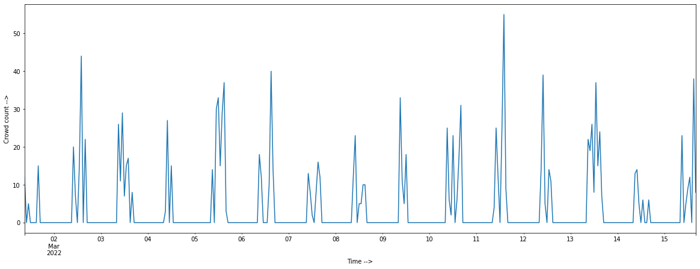
    


Adfuller stats to check for stationarity.


```python
result = adfuller(df_ts.values,autolag='AIC')
print(f'ADF Statistic: {result[0]}')
print(f'p-value: {result[1]}')
print('Critial Values:')
for key, value in result[4].items():
    print(f'  {key}: {value}')
```

    ADF Statistic: -7.821819082622866
    p-value: 6.639013340429399e-12
    Critial Values:
      1%: -3.45050711373316
      5%: -2.8704195794076743
      10%: -2.571500856923753
    

- p-value must be less than 0.05 and ADF statistic must be less than the critical values to conform stationarity.

- Stationarity means that the statistical properties of a time series do not change over time. Stationarity is important because many useful analytical tools and statistical tests and models rely on it.

### **Choosing the trend and seasonal elements (p,d,q)x(P,D,Q)s.**

The autocorrelation function (ACF) is a statistical technique that we can use to identify how correlated the values in a time series are with each other. Thus, autocorrelation is the correlation between a time series (signal) and a delayed version of itself.


```python
plot_acf(df_ts)
plt.show()
```


    
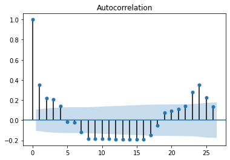
    


The decaying values suggest an AR model is relevant for this data.

Partial autocorrelation is a statistical measure that captures the correlation between two variables after controlling for the effects of other variables.


```python
plot_pacf(df_ts)
plt.show()
```


    
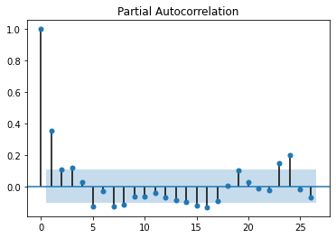
    


We can observe that we have a ar=1(from the significant spikes in PACF plot) and ma=1(from the significant spikes in ACF plot) as more significant thus we can use them in our model here. The periodicity can be set to 24 time periods i.e 24hrs. 

### **GridSearch to find the best values automatically based on AIC Score**


```python
# code found from here: https://www.bounteous.com/insights/2020/09/15/forecasting-time-series-model-using-python-part-two/

import itertools
import warnings
warnings.filterwarnings("ignore")

def sarima_grid_search(y,seasonal_period):
  p = d = q = range(0, 2)
  pdq = list(itertools.product(p, d, q))
  seasonal_pdq = [(x[0], x[1], x[2],seasonal_period) for x in list(itertools.product(p, d, q))]

  mini = float('+inf')
  
  for param in pdq:
    for param_seasonal in seasonal_pdq:
    #param_seasonal = (param[0], param[1], param[2],seasonal_period)
      try:
        mod = sm.tsa.statespace.SARIMAX(y,order=param,seasonal_order=param_seasonal,enforce_stationarity=False,enforce_invertibility=False)
        results = mod.fit()
        if results.aic < mini:
          mini = results.aic
          param_mini = param
          param_seasonal_mini = param_seasonal
          print('SARIMA{}x{} - AIC:{}'.format(param, param_seasonal, results.aic))
      except:
        continue
  print('The set of parameters with the minimum AIC is: SARIMA{}x{} - AIC:{}'.format(param_mini, param_seasonal_mini, mini))
  return param_mini, param_seasonal_mini
```

## **Baseline SARIMA Model**

**Why SARIMA?**

SARIMA is about the seasonality of the dataset. If the data is seasonal, like it will happen after a certain period of time, we need to use SARIMA.


```python
order, seasonal_order = sarima_grid_search(df_ts,24)
```

    SARIMA(0, 0, 0)x(0, 0, 0, 24) - AIC:2534.952571070025
    SARIMA(0, 0, 0)x(0, 0, 1, 24) - AIC:2331.4760678131242
    SARIMA(0, 0, 0)x(0, 1, 1, 24) - AIC:2037.384313471145
    SARIMA(0, 0, 1)x(0, 1, 1, 24) - AIC:2031.0146566354244
    SARIMA(1, 0, 1)x(0, 1, 1, 24) - AIC:2029.9514961417738
    The set of parameters with the minimum AIC is: SARIMA(1, 0, 1)x(0, 1, 1, 24) - AIC:2029.9514961417738
    


```python
model = sm.tsa.statespace.SARIMAX(endog=df_ts, order=order, seasonal_order=seasonal_order, freq='H')
```


```python
history = model.fit()
print(history.summary())
```

                                     Statespace Model Results                                 
    ==========================================================================================
    Dep. Variable:                                  y   No. Observations:                  344
    Model:             SARIMAX(1, 0, 1)x(0, 1, 1, 24)   Log Likelihood               -1111.356
    Date:                            Tue, 29 Mar 2022   AIC                           2230.712
    Time:                                    17:50:43   BIC                           2245.785
    Sample:                                03-01-2022   HQIC                          2236.731
                                         - 03-15-2022                                         
    Covariance Type:                              opg                                         
    ==============================================================================
                     coef    std err          z      P>|z|      [0.025      0.975]
    ------------------------------------------------------------------------------
    ar.L1          0.6795      0.327      2.081      0.037       0.039       1.319
    ma.L1         -0.5943      0.359     -1.656      0.098      -1.298       0.109
    ma.S.L24      -0.9993      8.678     -0.115      0.908     -18.008      16.010
    sigma2        49.8502    431.715      0.115      0.908    -796.296     895.997
    ===================================================================================
    Ljung-Box (Q):                       24.78   Jarque-Bera (JB):               945.93
    Prob(Q):                              0.97   Prob(JB):                         0.00
    Heteroskedasticity (H):               0.94   Skew:                             1.94
    Prob(H) (two-sided):                  0.75   Kurtosis:                        10.47
    ===================================================================================
    
    Warnings:
    [1] Covariance matrix calculated using the outer product of gradients (complex-step).
    

**The Akaike information criterion (AIC) is an estimator of prediction error and thereby relative quality of statistical models for a given set of data.**

- AIC penalizes a model with too many parameters. **The smaller the AIC score, the better fit the model will be to the data**. This criterion tends to select a model that slightly over fits the data.

P-value tells you the odds that a result occured might be of random chance. All P-values must be < 0.05 for us to consider the coefficient it highly significant.

## **Out of sample prediction**


```python
fc = history.predict(start = df_ts.index[-1], end = df_ts.index[-1]+timedelta(hours=48))
plt.figure(figsize=(15,5), dpi=100)
plt.plot(df_ts, label='training')
plt.plot(fc, label='forecast')
plt.xlabel('Time -->')
plt.ylabel('Crowd count -->')
plt.title('Forecast vs Actuals',fontsize=22)
plt.legend(loc='upper right', fontsize=17)
plt.show()
```


    
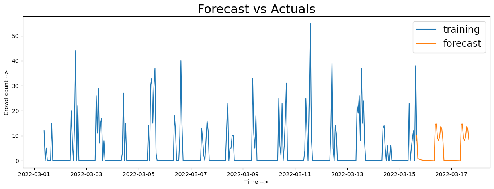
    


## **Forecasting for the training data** 


```python
fc = history.predict(start = df_ts.index[0], end = df_ts.index[-1])
plt.figure(figsize=(15,5), dpi=100)
plt.plot(df_ts, label='training')
plt.plot(fc, label='forecast')
plt.xlabel('Time -->')
plt.ylabel('Crowd count -->')
plt.title('Forecast vs Actuals',fontsize=22)
plt.legend(loc='upper right', fontsize=17)
plt.show()
```


    
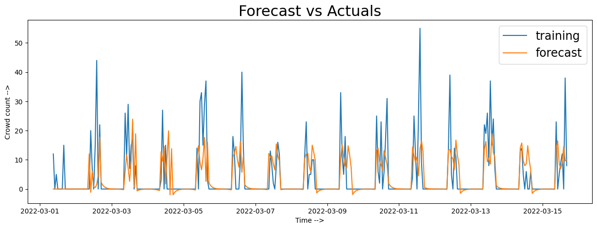
    


Mean Absolute error value for SARIMA model =


```python
mean_absolute_error(df_ts,fc)
```


    3.5595499167095253


## **Facebook Prophet Model**

**Why Facebook Prophet?**

Facebook Prophet is known for being able to handle multiple seasonality better in our case hourly and weekly seasonality and considering holidays.


```python
from fbprophet import Prophet
```

Preparing the dataframe for fitting in prophet


```python
df_prophet = df_ts.reset_index()
df_prophet = df_prophet.rename(columns = {'datetime':'ds',0:'y'}).reset_index().drop(['index'],axis=1)
```


```python
df_prophet.head(5)
```


  <div id="df-33f697a6-0de6-470a-9ff6-21668a08bfb4">
    <div class="colab-df-container">
      <div>
<style scoped>
    .dataframe tbody tr th:only-of-type {
        vertical-align: middle;
    }

    .dataframe tbody tr th {
        vertical-align: top;
    }

    .dataframe thead th {
        text-align: right;
    }
</style>
<table border="1" class="dataframe">
  <thead>
    <tr style="text-align: right;">
      <th></th>
      <th>ds</th>
      <th>y</th>
    </tr>
  </thead>
  <tbody>
    <tr>
      <th>0</th>
      <td>2022-03-01 09:00:00</td>
      <td>12</td>
    </tr>
    <tr>
      <th>1</th>
      <td>2022-03-01 10:00:00</td>
      <td>0</td>
    </tr>
    <tr>
      <th>2</th>
      <td>2022-03-01 11:00:00</td>
      <td>5</td>
    </tr>
    <tr>
      <th>3</th>
      <td>2022-03-01 12:00:00</td>
      <td>0</td>
    </tr>
    <tr>
      <th>4</th>
      <td>2022-03-01 13:00:00</td>
      <td>0</td>
    </tr>
  </tbody>
</table>
</div>
      <button class="colab-df-convert" onclick="convertToInteractive('df-33f697a6-0de6-470a-9ff6-21668a08bfb4')"
              title="Convert this dataframe to an interactive table."
              style="display:none;">

  <svg xmlns="http://www.w3.org/2000/svg" height="24px"viewBox="0 0 24 24"
       width="24px">
    <path d="M0 0h24v24H0V0z" fill="none"/>
    <path d="M18.56 5.44l.94 2.06.94-2.06 2.06-.94-2.06-.94-.94-2.06-.94 2.06-2.06.94zm-11 1L8.5 8.5l.94-2.06 2.06-.94-2.06-.94L8.5 2.5l-.94 2.06-2.06.94zm10 10l.94 2.06.94-2.06 2.06-.94-2.06-.94-.94-2.06-.94 2.06-2.06.94z"/><path d="M17.41 7.96l-1.37-1.37c-.4-.4-.92-.59-1.43-.59-.52 0-1.04.2-1.43.59L10.3 9.45l-7.72 7.72c-.78.78-.78 2.05 0 2.83L4 21.41c.39.39.9.59 1.41.59.51 0 1.02-.2 1.41-.59l7.78-7.78 2.81-2.81c.8-.78.8-2.07 0-2.86zM5.41 20L4 18.59l7.72-7.72 1.47 1.35L5.41 20z"/>
  </svg>
      </button>

  <style>
    .colab-df-container {
      display:flex;
      flex-wrap:wrap;
      gap: 12px;
    }

    .colab-df-convert {
      background-color: #E8F0FE;
      border: none;
      border-radius: 50%;
      cursor: pointer;
      display: none;
      fill: #1967D2;
      height: 32px;
      padding: 0 0 0 0;
      width: 32px;
    }

    .colab-df-convert:hover {
      background-color: #E2EBFA;
      box-shadow: 0px 1px 2px rgba(60, 64, 67, 0.3), 0px 1px 3px 1px rgba(60, 64, 67, 0.15);
      fill: #174EA6;
    }

    [theme=dark] .colab-df-convert {
      background-color: #3B4455;
      fill: #D2E3FC;
    }

    [theme=dark] .colab-df-convert:hover {
      background-color: #434B5C;
      box-shadow: 0px 1px 3px 1px rgba(0, 0, 0, 0.15);
      filter: drop-shadow(0px 1px 2px rgba(0, 0, 0, 0.3));
      fill: #FFFFFF;
    }
  </style>

      <script>
        const buttonEl =
          document.querySelector('#df-33f697a6-0de6-470a-9ff6-21668a08bfb4 button.colab-df-convert');
        buttonEl.style.display =
          google.colab.kernel.accessAllowed ? 'block' : 'none';

        async function convertToInteractive(key) {
          const element = document.querySelector('#df-33f697a6-0de6-470a-9ff6-21668a08bfb4');
          const dataTable =
            await google.colab.kernel.invokeFunction('convertToInteractive',
                                                     [key], {});
          if (!dataTable) return;

          const docLinkHtml = 'Like what you see? Visit the ' +
            '<a target="_blank" href=https://colab.research.google.com/notebooks/data_table.ipynb>data table notebook</a>'
            + ' to learn more about interactive tables.';
          element.innerHTML = '';
          dataTable['output_type'] = 'display_data';
          await google.colab.output.renderOutput(dataTable, element);
          const docLink = document.createElement('div');
          docLink.innerHTML = docLinkHtml;
          element.appendChild(docLink);
        }
      </script>
    </div>
  </div>


Fitting the time series to the model.


```python
m = Prophet(weekly_seasonality=True)
m.fit(df_prophet)
```

    INFO:fbprophet:Disabling yearly seasonality. Run prophet with yearly_seasonality=True to override this.
    


    <fbprophet.forecaster.Prophet at 0x7f54f2c29450>


Make a datetime series for which we need to forecast.


```python
future = m.make_future_dataframe(periods=0, freq='h')
```


```python
future.head(5)
```


  <div id="df-093c3bde-5103-493e-8cdd-ab0ffcdaee7c">
    <div class="colab-df-container">
      <div>
<style scoped>
    .dataframe tbody tr th:only-of-type {
        vertical-align: middle;
    }

    .dataframe tbody tr th {
        vertical-align: top;
    }

    .dataframe thead th {
        text-align: right;
    }
</style>
<table border="1" class="dataframe">
  <thead>
    <tr style="text-align: right;">
      <th></th>
      <th>ds</th>
    </tr>
  </thead>
  <tbody>
    <tr>
      <th>0</th>
      <td>2022-03-01 09:00:00</td>
    </tr>
    <tr>
      <th>1</th>
      <td>2022-03-01 10:00:00</td>
    </tr>
    <tr>
      <th>2</th>
      <td>2022-03-01 11:00:00</td>
    </tr>
    <tr>
      <th>3</th>
      <td>2022-03-01 12:00:00</td>
    </tr>
    <tr>
      <th>4</th>
      <td>2022-03-01 13:00:00</td>
    </tr>
  </tbody>
</table>
</div>
      <button class="colab-df-convert" onclick="convertToInteractive('df-093c3bde-5103-493e-8cdd-ab0ffcdaee7c')"
              title="Convert this dataframe to an interactive table."
              style="display:none;">

  <svg xmlns="http://www.w3.org/2000/svg" height="24px"viewBox="0 0 24 24"
       width="24px">
    <path d="M0 0h24v24H0V0z" fill="none"/>
    <path d="M18.56 5.44l.94 2.06.94-2.06 2.06-.94-2.06-.94-.94-2.06-.94 2.06-2.06.94zm-11 1L8.5 8.5l.94-2.06 2.06-.94-2.06-.94L8.5 2.5l-.94 2.06-2.06.94zm10 10l.94 2.06.94-2.06 2.06-.94-2.06-.94-.94-2.06-.94 2.06-2.06.94z"/><path d="M17.41 7.96l-1.37-1.37c-.4-.4-.92-.59-1.43-.59-.52 0-1.04.2-1.43.59L10.3 9.45l-7.72 7.72c-.78.78-.78 2.05 0 2.83L4 21.41c.39.39.9.59 1.41.59.51 0 1.02-.2 1.41-.59l7.78-7.78 2.81-2.81c.8-.78.8-2.07 0-2.86zM5.41 20L4 18.59l7.72-7.72 1.47 1.35L5.41 20z"/>
  </svg>
      </button>

  <style>
    .colab-df-container {
      display:flex;
      flex-wrap:wrap;
      gap: 12px;
    }

    .colab-df-convert {
      background-color: #E8F0FE;
      border: none;
      border-radius: 50%;
      cursor: pointer;
      display: none;
      fill: #1967D2;
      height: 32px;
      padding: 0 0 0 0;
      width: 32px;
    }

    .colab-df-convert:hover {
      background-color: #E2EBFA;
      box-shadow: 0px 1px 2px rgba(60, 64, 67, 0.3), 0px 1px 3px 1px rgba(60, 64, 67, 0.15);
      fill: #174EA6;
    }

    [theme=dark] .colab-df-convert {
      background-color: #3B4455;
      fill: #D2E3FC;
    }

    [theme=dark] .colab-df-convert:hover {
      background-color: #434B5C;
      box-shadow: 0px 1px 3px 1px rgba(0, 0, 0, 0.15);
      filter: drop-shadow(0px 1px 2px rgba(0, 0, 0, 0.3));
      fill: #FFFFFF;
    }
  </style>

      <script>
        const buttonEl =
          document.querySelector('#df-093c3bde-5103-493e-8cdd-ab0ffcdaee7c button.colab-df-convert');
        buttonEl.style.display =
          google.colab.kernel.accessAllowed ? 'block' : 'none';

        async function convertToInteractive(key) {
          const element = document.querySelector('#df-093c3bde-5103-493e-8cdd-ab0ffcdaee7c');
          const dataTable =
            await google.colab.kernel.invokeFunction('convertToInteractive',
                                                     [key], {});
          if (!dataTable) return;

          const docLinkHtml = 'Like what you see? Visit the ' +
            '<a target="_blank" href=https://colab.research.google.com/notebooks/data_table.ipynb>data table notebook</a>'
            + ' to learn more about interactive tables.';
          element.innerHTML = '';
          dataTable['output_type'] = 'display_data';
          await google.colab.output.renderOutput(dataTable, element);
          const docLink = document.createElement('div');
          docLink.innerHTML = docLinkHtml;
          element.appendChild(docLink);
        }
      </script>
    </div>
  </div>


Forecasting the crowd count for the given series.


```python
forecast=m.predict(future)
```

### Visualization of the prediction by model for the time series.


```python
fig1 = m.plot(forecast)
```


    
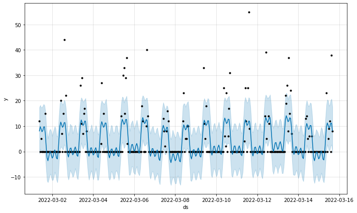
    


Mean Absolute error value for Prophet model =


```python
mean_absolute_error(df_ts,forecast['yhat'])
```


    4.35577017905525


### Visualisation various components of the time series.


```python
fig2 = m.plot_components(forecast)
```


    
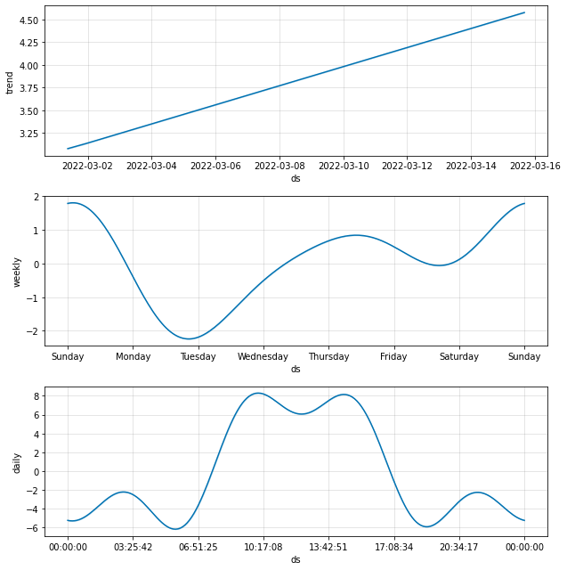
    


### **Conclusion**

We conclude that the both models are giving reasonable results with randomly generated data and thus needs further analysis and tuning with better data i.e real world data.
